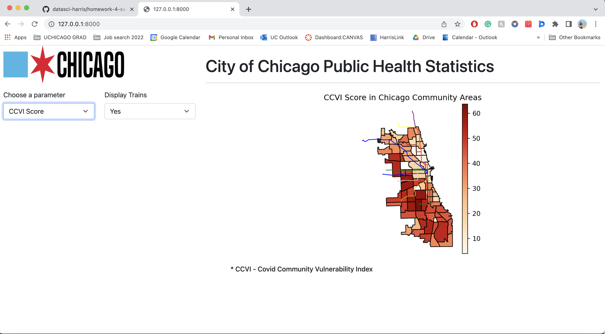

# Spatial Plotting Homework: Visualizing Public Health & Transit in Chicago

This project was developed as part of **Data Skills 2** at the University of Chicago. It explores spatial relationships between public health metrics and Chicago's CTA train lines using geospatial data and Python.

## Project Summary

The goal was to build an interactive choropleth map using [Shiny for Python](https://shiny.posit.co/py/), allowing users to toggle CTA "L" train lines and switch between two public health datasets. All data was sourced from the [City of Chicago Data Portal](https://data.cityofchicago.org/).

## Repository Contents

| File/Folder | Description |
|-------------|-------------|
| `app_hw4.py` | Main Shiny app script |
| `hw4.ipynb` | Jupyter notebook used for development and data prep |
| `Comm_20Areas__1/` | Community areas shapefile and components |
| `Chicago_COVID-19_Community_Vulnerability_Index_CCVI_.csv` | COVID-19 vulnerability data |
| `Public_Health_Statistics__2006_2010__Historical.csv` | Public health statistics |
| `web_page.png` | Screenshot of the app UI |
| `README.md` | This file |

> All shapefile components (e.g., `.shp`, `.shx`, `.dbf`, etc.) are included for full spatial analysis compatibility.

## Features

- **Interactive choropleth**: Switch between two datasets to color-code community areas
- **Transit overlay**: Toggle CTA "L" lines for transit access context
- **Clean UI** using Shiny’s layout controls and formatted plots

## Tools Used

- Python
- GeoPandas
- Pandas
- Matplotlib
- Shiny (Python interface)

## Learning Goals

- Load and clean shapefiles and public datasets
- Merge spatial and tabular data
- Visualize public health data geographically
- Create a responsive interactive map UI

---

**Author**: Saloni Bhardwaj  
 [Contact](mailto:bhardwajsaloni97@gmail.com) 
